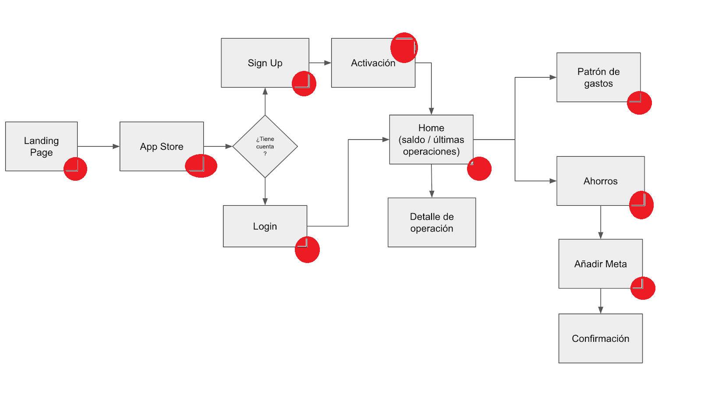

# Aplicación financiera

## Preámbulo

El banco más importante del país ha lanzado una nueva aplicación móvil al
mercado para que sus usuarios puedan visualizar sus gastos mensuales y fomentar
el ahorro. 

## Introducción
El banco me contrato como consultora UX para su aplicación móvil ,**TUS FINANZAS** el objetivo principal es detectar las areas de oportunidad en la aplicación y los puntos de dolor del usuario al usar la  aplicación  y para ello me brindaron  su informacion recabada en el trascurso de 6 meses.

### Contexto

Durante la primera semana de entendimiento de los requerimientos, el Product
Manager del equipo les brinda el contexto:

## Reporte de resultados  de esta primer semana

Analizando detenidamente los recursos proporcionados por el banco y por el Product Manager se detectarón los siguientes puntos de dolor  al momento de usar la aplicación.

> El usuario se siente inseguro al aceptar Terminos y Condiciones que desconoce.

> Los datos que le piden para instalar la aplicación le parecen innecesarios al usuario.

> No le indican que la aplicación es para IOS y el usuario tiene un teledono de plataforma Android.

En el flujo actual se detectaron puntos de dolor en los usuarios,ya que el hecho de que la aplicación cuente con  varios filtros de seguridad y confirmación les parece demasiado y poco entendible ademas de que les toma bastante tiempo el poder llegar a el menú que ellos necesitan.

# Problemas Detectados 
 (https://docs.google.com/document/d/14Jie6j3rvzkRB5JZqREnG3sAu14To6zw3eqK8IuXkt4/edit?usp=sharing)
 
 - 1: **Las User persona no estaban bien definidas y al eso genero conflictos  en los anuncios e facebook ya que no estaba bien segmentado el publico destino.**

- 2: **La información de la landing page no  es clara y no especifica que la aplicación esta diseñada para iphone ,lo cual ha generado problemas ya que muchos usuarios de android han accedido a ella pero no la han podido utilizar ya que  no es compatible con su plataforma móvil.**

- 3: **La aplicación apesar de ser de un banco en ningún momento lo indica y eso genera desconfianza en los usuarios.**

- 4: **El registro es un proceso muy largo ademas de que le pide el número de cuenta al usuario y el no cuenta con ese número al momento**

- 5:**Al concluir el proceso de registro al usuario le pide que  registre su correo y cree una contraseña,ademas le pide crear un usuario y contraseña y le pide registro de huella**

- 6: **La aplicación es dificl de usar ya que los botones son muy pequeños y la información no es muy legible y eso dificulta al usuario poder visualizar sus gastos ademas de que la información esta sobrecargada y eso hace poco legible el texto.**

# Herramientas utilizadas

### Test de Usabilidad
### Entrevistas
### User Personas 
### Customer Journey
### Wireframes
### Prototipo de Alta fidelidad

# Desarrollo
Mediante las entrevistas realizadas se pudo llegar  a las personas idoneas  para nuestro producto las cuales son las siguientes.

Direccionando el producto a las personas idoneas ,se propone modificar la publicidad en facebook ya que no esta bien  perfilada y eso ha generado mas conflictos .

### Se detecto lo siguiente:

El primer recurso que se descartó fue la  user persona  primaria que el banco nos proporciono ,ya que esta user persona no entra en el perfil que maneja el banco para sus usuarios.

Ademas de que la joven no sabe administrar su cuenta,no genera ingresos propios .
Esta hipotesis se respaldo ,con entrevistas a adolescentes de 18 y 19 años de edad,permititendo asi poder descartar a esta user persona.

Otro punto que se detecto es que no se contemplo entre sus usuarios a mujeres entre el 25 - 30 años de edad,ya que ellas tambien tiene cuenta bancaria y les gusta priorizar **el ahorro**.

**En México hay 61.4 millones de mujeres, es decir, el 51.4% de la población, y en términos proporcionales, la relación por sexo es de 94.4 hombres por cada 100 mujeres, informó el Instituto Nacional de Estadística y Geografía (INEGI).**

Con base en la Encuesta Intercensal 2015, las entidades que cuentan con una mayor presencia relativa de mujeres son la Ciudad de México, con una relación de 90.3 hombres por cada 100 mujeres, Oaxaca con 90.8 y Puebla con una relación de 91.3

Ademas con la data  proporcionada se propone crear la aplicación para android ya que el 88 % de los usuarios que ingresaron su telefono era de gama media ,android.

 

fuente de consulta (http://cuentame.inegi.org.mx/poblacion/mujeresyhombres.aspx?tema=P)
(https://www.unotv.com/noticias/portal/nacional/detalle/mujeres-representan-514-poblacion-en-mexico-396402/)

(http://www.domesticatueconomia.es/prioridades-del-ahorro-funcion-nuestra-edad/)

(https://docs.google.com/presentation/d/17nJqFYanOyk0j1Podh8Le9wX3KWzFG8bhXIIz-_shTo/edit?usp=sharing)

Android vs IOS
(https://www.merca20.com/android-vs-ios-sistema-operativo-resalta-en-mexico/)