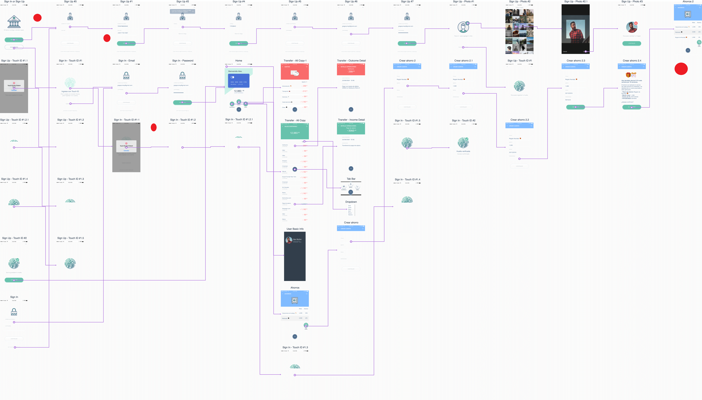

# Aplicación financiera

## Preámbulo

El banco más importante del país ha lanzado una nueva aplicación móvil al
mercado para que sus usuarios puedan visualizar sus gastos mensuales y fomentar
el ahorro. Luego de tener algunos meses en el mercado, el
equipo detrás de este nuevo producto ha decidido contratar a una
agencia/consultora de UX que los ayude a definir la dirección y evolución del
producto. Tú has sido elegida como la consultora líder de UX y se te ha asignado el proyecto para hacer un diagnóstico, evaluar el desempeño de la aplicación y proponer los cambios necesarios para optimizar el producto.

## Introducción

### Contexto

Durante la primera semana de entendimiento de los requerimientos, el Product
Manager del equipo les brinda el contexto:

>“Todo empezó hace un año cuando vimos que en EEUU y Europa estaban saliendo
  nuevas aplicaciones financieras que nos llamaron la atención. Unas se enfocan
  en darle visibilidad a sus usuarios sobre los gastos, otras en facilitar pagos
  a terceros y otras a fomentar el ahorro. Inspirados en un par de ellas,
  decidimos lanzar una nueva aplicación. Decidimos que era mejor crear un
  producto desde cero - en lugar de modificar la aplicación actual de banca
  móvil - para poder desarrollarla con un equipo totalmente nuevo, en el
  laboratorio de innovación, bajo prácticas ágiles. Sabemos que no es ideal que
  nuestros usuarios tengan que usar dos aplicaciones, pero desarrollar con un
  equipo nuevo que corra ágil nos da mayor libertad.

> Empezamos entrevistando a algunos usuarios y revisando los resultados de un
  estudio de mercado que nos proporcionó el área de marketing. Eso nos dió una
  idea inicial de qué funcionalidades son más relevantes aquí en nuestro
  mercado. Con base en esos resultados, creamos nuestros primeros user personas
  una primaria y una secundaria ( creemos que estas personas no son las que
  nosotros pensábamos inicialmente), y diseñamos y desarrollamos un ‘Producto
  mínimo viable’ (MVP) en 2 meses en iOS. Ese MVP lo hemos lanzado y tenemos
  alrededor de 6 meses de data. Hoy estamos en el proceso de entender los
  resultados iniciales y de sacar una segunda iteración del producto. Y para eso
  las hemos contratado. Toda la documentación de este producto la tenemos en una
  carpeta de [Google Drive](https://drive.google.com/drive/u/0/folders/1NWf4701uKDsCK0eLNI8RXEocrI1g1zqd). Les doy acceso.

> Necesitamos traer una propuesta del nuevo diseño en dos semanas porque tenemos
  que presentarla a nuestro Gerente General en la reunión trimestral. Es
  importante que cualquier cosa que presentemos ya incorpore feedback de testing
  con usuarios. El Gerente General, animado por el crecimiento del número de
  descargas que ha tenido el app, quiere duplicar el presupuesto de Facebook
  Ads… Yo no estoy tan seguro; quisiera que como parte de su trabajo estas
  próximas dos semanas, entendamos ese punto también.”

### Recursos

En esta carpeta de [Google Drive](https://drive.google.com/drive/u/0/folders/1NWf4701uKDsCK0eLNI8RXEocrI1g1zqd) y en los siguientes
links, encontrarán:

- Los user persona primario y secundario del proyecto
- Los user flows iniciales y actuales del proyecto del MVP
- El [diseño del app en Figma](https://www.figma.com/file/Gr5GEIRrjF9eIplIeEHUSJNt/proyecto-2-banca?node-id=0%3A477)
  , con una guía de componentes y el [Prototipo navegable](https://marvelapp.com/e9h245e)
- Funnel Analytics de los primeros 6 meses del MVP
- Data de uso del MVP de los primeros 6 meses
- [Landing Page](http://tus-finanzas.pagedemo.co) inicial del producto

## Objetivos iniciales del proyecto

El principal objetivo del banco es ofrecerle una alternativa eficaz y segura para las personas ,que ya son clientes asiduos de este banco.

Permitiendoles tener en esta aplicación una manera facíl y rápida para un mejor manejo de sus cuentas.

El banco desea poder generar una relación a largo plazo con sus clientes.

Ademas en un futuro poderle ofrecer servicios de crédito o inversion muy afines y personalizadas ,ayudandoles de esa manera a sus usuarios a lograr sus metas .
 

## Reporte de resultados  de esta primer semana

Analizando detenidamente los recursos proporcionados por el banco y por el Product Manager se detectarón los siguientes puntos de dolor  al momento de usar la aplicación.

El usuario se siente inseguro al aceptar Terminos y Condiciones que desconoce.
Le parece alarmante que le aparezcan al inicio ,antes de poder seguir el proceso dentro de la aplicación.
El flujo se rompe al momento de visualizar el menú.
La aplicación no es intuitiva.

En el flujo actual se detectaron puntos de dolor en los usuarios,ya que el hecho de que la aplicación cuente con  varios filtros de seguridad y confirmación les parece demasiado y poco entendible ademas de que les toma bastante tiempo el poder llegar a el menú que ellos necesitan.

# Problemas 

### Se detecto lo siguiente:

El primer recurso que se descartó fue la  user persona  primaria que el banco nos proporciono ,ya que esta user persona no entra en el perfil que maneja el banco para sus usuarios.
Ademas de que la joven no sabe administrar su cuenta,no genera ingresos propios .
Esta hipotesis se respaldo ,con entrevistas a adolescentes de 18 y 19 años de edad,permititendo asi poder descartar a esta user persona.

Otro punto que se detecto es que no se contemplo entre sus usuarios a mujeres entre el 25 - 30 años de edad,ya que ellas tambien tiene cuenta bancaria y les gusta priorizar **el ahorro**.

En México hay 61.4 millones de mujeres, es decir, el 51.4% de la población, y en términos proporcionales, la relación por sexo es de 94.4 hombres por cada 100 mujeres, informó el Instituto Nacional de Estadística y Geografía (INEGI).

Con base en la Encuesta Intercensal 2015, las entidades que cuentan con una mayor presencia relativa de mujeres son la Ciudad de México, con una relación de 90.3 hombres por cada 100 mujeres, Oaxaca con 90.8 y Puebla con una relación de 91.3

fuente de consulta (http://cuentame.inegi.org.mx/poblacion/mujeresyhombres.aspx?tema=P)
(https://www.unotv.com/noticias/portal/nacional/detalle/mujeres-representan-514-poblacion-en-mexico-396402/)

(http://www.domesticatueconomia.es/prioridades-del-ahorro-funcion-nuestra-edad/)

(https://docs.google.com/presentation/d/17nJqFYanOyk0j1Podh8Le9wX3KWzFG8bhXIIz-_shTo/edit?usp=sharing)

# Entrevistas

Mediante las entrevistas realizadas se pudo llegar  a las personas idoneas  para nuestro producto las cuales son las siguientes.

# Solución

